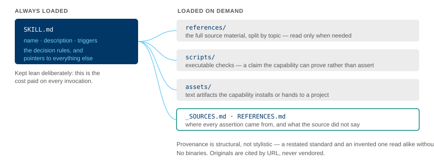
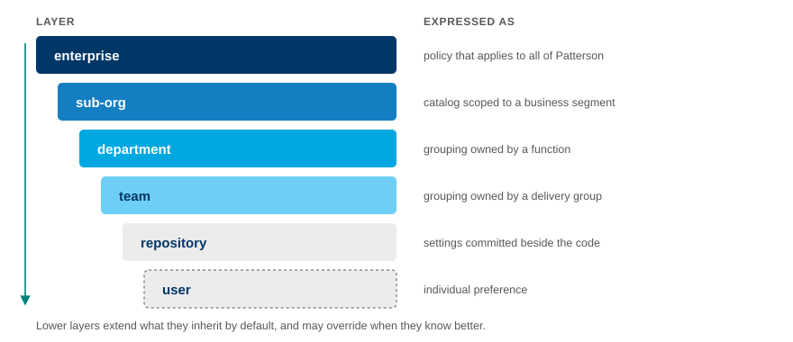
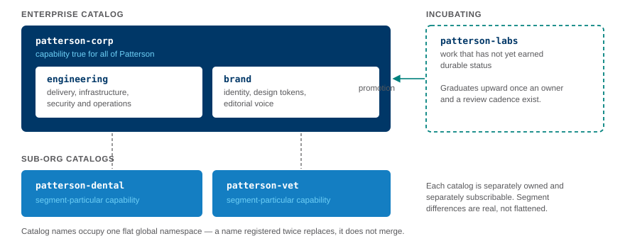

<div align="center">


# patterson-corp

**Trusted Expertise. Unrivaled Support.** — Patterson's institutional knowledge,
encoded as installable [agent plugins](https://code.claude.com/docs/en/plugin-marketplaces).


</div>

---

## Table of contents

- [What this is](#what-this-is)
- [Quick start](#quick-start)
- [Plugin catalog](#plugin-catalog)
- [Anatomy of a capability](#anatomy-of-a-capability)
- [The layered model](#the-layered-model)
- [Where it fits](#where-it-fits)
- [Repository layout](#repository-layout)
- [Scripts and validation](#scripts-and-validation)
- [Contributing and governance](#contributing-and-governance)
- [Provenance and gaps](#provenance-and-gaps)
- [Brand and licensing](#brand-and-licensing)

## What this is

The enterprise catalog of the Patterson agent platform. It holds the capability that is true for
**all** of Patterson — engineering standards and brand identity — as two independently installable
plugins.

The organizing intent is that an agent working on Patterson code behaves the way a well-oriented
Patterson colleague would: aware of the standards that apply, able to cite them, and able to say when
a standard does not cover the situation at hand.

See [PROJECT-CHARTER.md](../PROJECT-CHARTER.md) for goals and scope.

## Quick start

```bash
# inside Claude Code
/plugin marketplace add patterson-agents/patterson-corp
/plugin install patterson-engineering@patterson-corp
/plugin install patterson-brand@patterson-corp
```

From a local checkout:

```bash
cd patterson-corp
claude
/plugin marketplace add .
/plugin install patterson-brand@patterson-corp
```

Then use it three ways:

```text
"does this pipeline meet our standards?"        ← skill fires automatically
"drop the Patterson theme into this project"    ← design-tokens installs theme.css
"review this page for brand compliance"         ← delegates to the reviewer subagent
```

> [!NOTE]
> The same catalog is consumed by VS Code and GitHub Copilot. VS Code reads `.claude/settings.json`
> with identical `extraKnownMarketplaces` and `enabledPlugins` keys, and defers to this
> `marketplace.json` schema.

## Plugin catalog

| Plugin | What it is | Skills |
|---|---|---|
| **[`patterson-engineering`](plugins/patterson-engineering/)**<br>Standards | Patterson's IT standards for delivery, infrastructure, data and operations — with executable validators and a compliance-reviewer subagent. | `cicd-pipeline-standards` · `azure-environment-standards` · `azure-compute-standards` · `storage-data-standards` · `monitoring-alerting-standards` · `approved-software-check` · `github-security-scanning` |
| **[`patterson-brand`](plugins/patterson-brand/)**<br>Identity | Brand identity, a drop-in Tailwind v4 + shadcn/ui theme generated from tokens, and the editorial voice for each sub-brand. | `brand-identity` · `design-tokens` · `copy-style-guide` · `voice-and-tone` · `presentation-templates` |

Each plugin has its own README with the full skill list, validator behaviour, and open questions.

## Anatomy of a capability

<p align="center"></p>

The split is the point. `SKILL.md` is the cost paid on *every* invocation, so it carries only triggers
and decision rules. Full standard text, executable checks, and installable artifacts sit behind it and
load when they are actually needed.

## The layered model

<p align="center"></p>

`patterson-corp` is the **enterprise** layer. Lower layers extend it by default and may override it
when they know better — divergence is treated as information about where a standard is incomplete,
not as a violation to suppress.

> [!IMPORTANT]
> Nothing here is enforced yet. The layer configuration demonstrates the shape of ownership; the
> enforcement switches are documented and deliberately left off.

## Where it fits

<p align="center"></p>

| Catalog | Role |
|---|---|
| `patterson-corp` | Enterprise — capability true for all of Patterson |
| `patterson-labs` | Incubating — work that has not yet earned durable status |
| `patterson-dental` | Sub-org — segment-particular capability |
| `patterson-vet` | Sub-org — segment-particular capability |

> [!WARNING]
> Catalog names occupy one **flat global namespace**. Registering a second catalog under an existing
> name replaces the first rather than merging with it.

## Repository layout

```text
patterson-corp/
├── .claude-plugin/
│   └── marketplace.json              # the catalog agents read
├── plugins/
│   ├── patterson-engineering/
│   │   ├── skills/<name>/            # SKILL.md · references/ · scripts/ · _SOURCES.md
│   │   ├── agents/                   # standards-compliance-reviewer
│   │   └── hooks/                    # PreToolUse guard + tests
│   └── patterson-brand/
│       ├── skills/<name>/            # SKILL.md · references/ · assets/ · _SOURCES.md
│       └── agents/                   # brand-compliance-reviewer
├── scripts/
│   ├── check-size.ts                 # 2 MiB tracked-byte budget validator
│   ├── check-no-binaries.ts          # fonts / office / archive / oversized-raster validator
│   ├── verify-all.sh                 # the gate battery -- CI and pre-commit both call this
│   └── tests/                        # TDD fixtures for the two validators above
├── .github/                          # issue + PR templates, Copilot config, ci.yml
├── .githooks/                        # pre-commit (opt in: git config core.hooksPath .githooks)
├── .devcontainer/                    # pinned node:24 devcontainer
├── openspec/                         # every change proposed and specced before it lands
├── docs/
│   ├── assets/                       # logos (SVG)
│   ├── diagrams/                     # architecture diagrams
│   ├── architecture/
│   └── decisions/                    # ADRs
├── CONTRIBUTING.md · CODE_OF_CONDUCT.md · SECURITY.md · CODEOWNERS
└── README.md                         # you are here
```

## Scripts and validation

All scripts are TypeScript, run directly by Node — **no build step, no bundler, no `package.json`,
no dependencies**. Node ≥ 22.18 strips types natively; Patterson standardises on `node:24`.

```bash
node plugins/patterson-engineering/skills/cicd-pipeline-standards/scripts/check-pipeline.ts .github/workflows/ci.yml
```

| Contract | Value |
|---|---|
| Argument | a path to check |
| Exit `0` | pass |
| Exit `1` | violations found |
| Exit `2` | could not evaluate |
| Output | `LEVEL\|file\|line\|rule\|message` |

Run every test suite, plus the repository-wide invariants (theme round-trip, skill
name-equals-directory, forbidden strings, no binaries, the size budget):

```bash
sh scripts/verify-all.sh
```

`scripts/verify-all.sh` is the single gate battery — the same script `.github/workflows/ci.yml`
and `.githooks/pre-commit` both call. Running individual suites directly still works:

```bash
for t in $(find . -name run-tests.sh); do sh "$t"; done
```

> [!CAUTION]
> Scripts must use **erasable syntax only** — no `enum`, `namespace`, parameter properties, or legacy
> decorators. Node's type stripping cannot erase these and will throw at runtime.

## Contributing and governance

| File | Purpose |
|---|---|
| [`CONTRIBUTING.md`](CONTRIBUTING.md) | The OpenSpec proposal workflow, repository conventions, and the test-first requirement |
| [`REFERENCES.md`](REFERENCES.md) | Index of authoritative sources — ServiceNow standards, the Brand Guide 2025, and vendor documentation — linking to each skill's own `REFERENCES.md` |
| [`CODE_OF_CONDUCT.md`](CODE_OF_CONDUCT.md) | Contributor Covenant, adapted for a B2B engineering context |
| [`SECURITY.md`](SECURITY.md) | Private vulnerability reporting; no invented SLA |
| [`CODEOWNERS`](CODEOWNERS) | A reviewing team for every top-level path (placeholder handles pending real assignment) |
| [`.github/ISSUE_TEMPLATE/`](.github/ISSUE_TEMPLATE/) | Bug, feature, new-plugin, and new-skill proposal forms |
| [`.github/pull_request_template.md`](.github/pull_request_template.md) | Checklist including the 2-approver rule, tests, provenance, no-binaries, and the size budget |
| [`.github/workflows/ci.yml`](.github/workflows/ci.yml) | Runs `scripts/verify-all.sh` on every push and pull request, pinned to Node 24 |
| [`.github/copilot-instructions.md`](.github/copilot-instructions.md) | The same conventions, phrased for an in-editor agent |
| [`.github/secret_scanning.yml`](.github/secret_scanning.yml) | Excludes the hooks test fixtures' deliberately synthetic secrets |
| [`.githooks/pre-commit`](.githooks/pre-commit) · [`.pre-commit-config.yaml`](.pre-commit-config.yaml) | The fast local gate (opt in with `git config core.hooksPath .githooks`) |
| [`.devcontainer/devcontainer.json`](.devcontainer/devcontainer.json) | Pinned `node:24`-family image, zero install step |

> [!NOTE]
> There is no `LICENSE` file. Every plugin manifest declares `"license": "UNLICENSED"` pending a
> Patterson legal ruling — see `CONTRIBUTING.md`. This is a recorded open question, not an
> oversight.

## Provenance and gaps

Every assertion traces to a source. Each skill carries `_SOURCES.md` (where it came from, with
confidence) and `REFERENCES.md` (canonical locations).

Where a source is silent, the silence is recorded rather than filled:

```bash
grep -rn '\[TBD' plugins/
```

> [!IMPORTANT]
> A `[TBD]` marker is working as designed. The platform never manufactures organizational policy —
> when encoded knowledge appears to require something Patterson has not actually stated, that is a
> finding to escalate, not a decision to make here.

Material open items are listed in each plugin's README.

## Brand and licensing

Patterson logos and brand imagery are proprietary; Proxima Nova is licensed through Adobe Fonts and
**no font binaries are distributed here**. Distribute this catalog privately.

No emoji on brand surfaces — this is a B2B healthcare distribution brand. The check marks that appear
inside `voice-and-tone` are quoting Patterson's own published social examples and are intentional.
